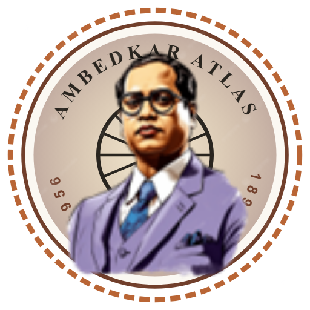
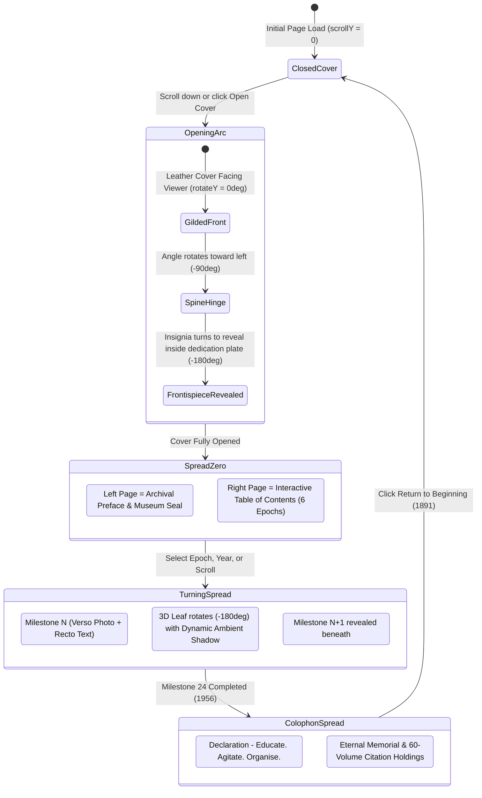
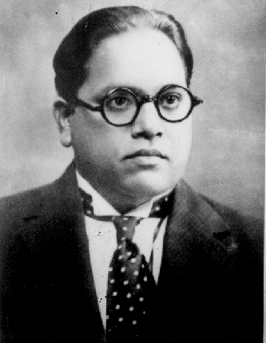
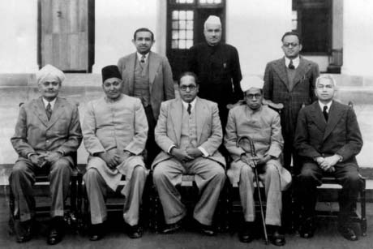
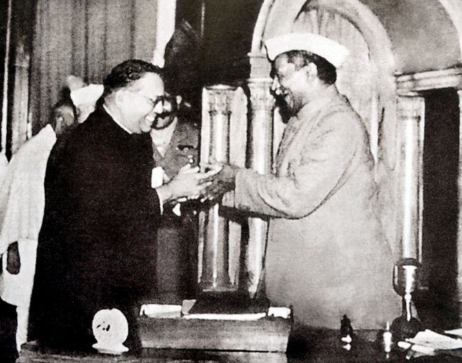
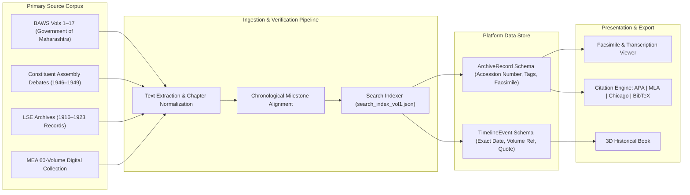

<p align="center">
  
</p>

<h1 align="center">AMBEDKAR ATLAS</h1>

<p align="center">
  <strong>National Digital Heritage Archive &amp; Editorial Research Platform for Dr. B. R. Ambedkar (1891–1956)</strong><br />
  <em>A high-performance, editorial museum-grade research suite commemorating the life, treatises, constituent debates, and constitutional legacy of Babasaheb Dr. Bhimrao Ramji Ambedkar.</em>
</p>

<p align="center">
  
  
  
  
  
  
  
</p>

---

## Table of Contents

- [Curatorial Vision & Overview](#curatorial-vision--overview)
- [System Architecture](#system-architecture)
- [The 3D Book of Ambedkar](#the-3d-book-of-ambedkar)
  - [3D Page Turn State Machine](#3d-page-turn-state-machine)
  - [Acoustic Engineering & Web Audio Synthesis](#acoustic-engineering--web-audio-synthesis)
- [Archival Chronology & Verified Milestones](#archival-chronology--verified-milestones)
  - [Six Canonical Historical Epochs](#six-canonical-historical-epochs)
  - [Authentic Photographic Holdings](#authentic-photographic-holdings)
- [Core Application Suites](#core-application-suites)
  - [1. Cinematic Parallax Discovery](#1-cinematic-parallax-discovery)
  - [2. Multi-Faceted Catalog Browser](#2-multi-faceted-catalog-browser)
  - [3. Archival Document Inspection Deck](#3-archival-document-inspection-deck)
  - [4. Grounded AI Research Console](#4-grounded-ai-research-console)
  - [5. Public Museum Touch Kiosk](#5-public-museum-touch-kiosk)
- [Archival Ingestion & Citation Pipeline](#archival-ingestion--citation-pipeline)
- [Design System & Typography](#design-system--typography)
- [Directory Structure](#directory-structure)
- [Installation & Development](#installation--development)
- [Academic Citation & Archival Provenance](#academic-citation--archival-provenance)

---

## Curatorial Vision & Overview

The **Ambedkar Atlas** is an institutional-grade digital heritage archive engineered to provide unrestricted, rigorous public and scholarly access to the complete documentary record of **Dr. Bhimrao Ramji Ambedkar** (14 April 1891 – 6 December 1956). 

Dr. Ambedkar served as Chief Architect of the Constitution of the Republic of India, First Law Minister of Independent India, world-renowned economist (Columbia University, London School of Economics), anthropologist, legal philosopher, and champion of human emancipation.

Unlike conventional flat catalogs, the Ambedkar Atlas operates as an interactive digital museum combining:
- **Primary Source Ingestion**: Verified holdings indexed directly from the Ministry of External Affairs (MEA) 60-volume national edition and the Dr. Babasaheb Ambedkar Writings and Speeches (BAWS) collection.
- **Realistic 3D Book Simulation**: A physics-based, 3D hardcover chronicle enabling visitors to flip through 65 years of history page by page.
- **Multi-Modal Research Console**: Synthetic citation-grounded inquiry with indexed references pointing directly to volume and page numbers.
- **Museum Kiosk & Universal Exhibition**: Touchscreen layout, high-contrast modes, synthetic audio narration, and multi-device responsive scaling.

---

## System Architecture

The following diagram illustrates the component architecture, data ingestion layer, and interaction routes across the platform:

```mermaid
flowchart TD
    subgraph Client_Entry ["Entry & Presentation Layer"]
        IndexHTML["index.html"] --> MainApp["main.tsx / App.tsx"]
        MainApp --> Header["Header (Brand Insignia & Nav)"]
        MainApp --> Footer["Footer (Provenance & Colophon)"]
    end

    subgraph Navigation_Routes ["Application Routes (React Router 7)"]
        MainApp --> RouteHome["/ (Cinematic Parallax Home)"]
        MainApp --> RouteArchive["/archive (Catalog Explorer)"]
        MainApp --> RouteViewer["/archive/:id (Facsimile & Reader Deck)"]
        MainApp --> RouteTimeline["/timeline (3D Book of Ambedkar)"]
        MainApp --> RouteResearch["/research (AI Research Console)"]
        MainApp --> RouteKiosk["/kiosk (Touchscreen Museum Kiosk)"]
        MainApp --> RouteSearch["/search (Global Full-Text Search)"]
        MainApp --> RouteAbout["/about (Editorial Preservation Charter)"]
    end

    subgraph Timeline_Engine ["3D Book of Ambedkar Engine"]
        RouteTimeline --> HistBook["Historical3DBook.tsx"]
        HistBook --> BookCover["BookCover.tsx (3D Leather Cover)"]
        HistBook --> BookTOC["BookTableOfContents.tsx (Conspectus)"]
        HistBook --> BookSpread["BookSpread.tsx (Verso & Recto Leaves)"]
        HistBook --> BookControls["BookControls.tsx (HUD & Year Scrubber)"]
        HistBook --> EventVisuals["eventVisuals.ts (Archival Photo Maps)"]
        HistBook --> BookAudio["bookSound.ts (Web Audio Synthesizer)"]
    end

    subgraph Data_Services ["Archival Service & Ingestion Layer"]
        ArchiveService["archiveService.ts (Asynchronous Service)"]
        ArchiveService --> MEAVolumes["MEA 60-Volume Text Corpus"]
        ArchiveService --> TimelineData["timelineEvents.ts (24 Authenticated Events)"]
        ArchiveService --> ArchiveRecords["archiveRecords.ts (18 Master Catalog Records)"]
        ArchiveService --> SearchIndex["search_index_vol1.json (Full-Text Inverted Index)"]
    end

    subgraph Storage_Layer ["Browser Storage & Persistence"]
        BookmarksStore["localStorage: ambedkar_atlas_bookmarks"]
        RecentSearchesStore["localStorage: ambedkar_atlas_recent_searches"]
        SessionTimelineStore["sessionStorage: ambedkar_atlas_timeline_year"]
    end

    RouteArchive --> ArchiveService
    RouteViewer --> ArchiveService
    RouteTimeline --> ArchiveService
    RouteResearch --> ArchiveService
    RouteSearch --> ArchiveService
    RouteArchive --> BookmarksStore
    RouteSearch --> RecentSearchesStore
    RouteViewer --> SessionTimelineStore
```



---

## The 3D Book of Ambedkar

The flagship experiential feature of the archive is **The Book of Ambedkar** (`/timeline`). Rather than presenting history as an ordinary flat scroll, the application renders a realistic, volume-bound hardcover book positioned on a museum exhibition reading desk.

### 3D Page Turn State Machine

The book transitions smoothly across realistic physical states driven by scroll progress, drag gestures, or direct year selection:



### Acoustic Engineering & Web Audio Synthesis

To ensure a visceral archival tactile experience without relying on external MP3 audio network dependencies, the application includes a custom procedural acoustic engine in `src/components/timeline/book/bookSound.ts`:

- **White Noise Audio Buffer**: Generates a 0.28-second randomized buffer simulating paper friction.
- **Bi-Quad Frequency Filtering**: Passes noise through a low-pass filter centered between 700 Hz and 950 Hz with a Q-factor of 1.4 to replicate aged heavy cotton rag paper.
- **Exponential Gain Decay**: Shapes the envelope with a rapid 12 ms attack followed by a realistic 220 ms exponential decay curve.
- **Audio State Toggle**: Fully accessible mute toggle accessible directly in the top HUD.

---

## Archival Chronology & Verified Milestones

The chronological backbone contains 24 rigorously verified events covering Dr. Ambedkar's entire life (1891–1956).

### Six Canonical Historical Epochs

| Epoch ID | Date Span | Era Title | Milestone Focus & Canonical Treatises | Verified Holdings |
|:---|:---|:---|:---|:---|
| **Epoch I** | 1891–1912 | Early Life & Formative Education | Birth at Mhow Cantonment; Matriculation from Elphinstone High School; Presentation of life of Gautama Buddha. | BAWS Vol. 12 |
| **Epoch II** | 1913–1923 | Academic Scholarship & Jurisprudence | Columbia University residency; *Castes in India* treatise; Gray's Inn Bar admission; University of London D.Sc. (Econ); *The Problem of the Rupee*. | BAWS Vol. 1, 6 |
| **Epoch III** | 1924–1935 | Social Rights & Mass Mobilization | Bahishkrit Hitakarini Sabha founding; Mahad Chavadar Tank Satyagraha; Manusmriti Dahan; Round Table Conferences; Yerwada Poona Pact; Yeola Declaration. | BAWS Vol. 2, 17 |
| **Epoch IV** | 1936–1946 | Political Leadership & National Labour | Publication of *Annihilation of Caste*; Independent Labour Party founding; Viceroy's Executive Council (Labour Portfolio: 8-hour workday, power grid, maternity benefits). | BAWS Vol. 1, 10 |
| **Epoch V** | 1947–1951 | Drafting Constitution & Law Ministry | Appointment as Chairman of the Drafting Committee; Presentation of the Draft Constitution; *The Grammar of Anarchy* address; Resignation over Hindu Code Bill. | BAWS Vol. 13, 14 |
| **Epoch VI** | 1952–1956 | Buddhist Renaissance & Final Opus | Rajya Sabha parliamentary interventions; Completion of *The Buddha and His Dhamma*; Historic Conversion at Deekshabhoomi, Nagpur; Mahaparinirvana. | BAWS Vol. 11, 15 |

### Authentic Photographic Holdings

Each milestone spread pairs the primary textual narrative with verified archival photographs cataloged in `src/assets/timeline/`:

```
src/assets/timeline/
├── young_ambedkar.gif                               (1891, 1907 - Early Life & High School)
├── ambedkar_columbia_university.jpg                 (1913, 1916 - Columbia University Scholar)
├── ambedkar_lse_professors_1916.jpg                 (1916, 1923 - London School of Economics)
├── ambedkar_barrister_1922.jpg                      (1919, 1920, 1924 - Barrister Practice & Mooknayak)
├── ambedkar_poona_pact_1932.jpg                     (1927, 1930, 1932 - Mahad Satyagraha & Poona Pact)
├── ambedkar_rajagriha_family_1934.jpg               (1934, 1935 - Rajagriha Residence & Yeola)
├── dr_babasaheb_ambedkar_at_home_rajgriha___1946.jpg (1936, 1942 - Personal Study & Viceroy's Council)
├── ambedkar_drafting_committee_1947.jpg             (1947 - Constitution Drafting Committee)
├── ambedkar_savita_1948.jpg                         (1948 - Introducing Draft Constitution)
├── ambedkar_presenting_constitution_1949.jpg        (1949 - Handover to President Rajendra Prasad)
├── ambedkar_in_1950.jpg                             (1950, 1951 - First Minister of Law)
├── ambedkar_address_columbia_1954.jpg               (1954 - Doctor of Laws Address, Columbia)
└── ambedkar_conversion_speech_1956.jpg              (1956 - Deekshabhoomi Dhamma Deeksha, Nagpur)
```

### Visual Archival Exhibition & Media Showcase

<p align="center">
  
  &nbsp;&nbsp;&nbsp;&nbsp;
  
  &nbsp;&nbsp;&nbsp;&nbsp;
  
</p>

<p align="center">
  <em>Figure: Authenticated historical photographs, archival animation, and photographic plates integrated within the 3D Book of Ambedkar and documentary catalog.</em>
</p>

### Interactive Motion & Animation Architecture

The platform implements physics-grounded choreography using CSS 3D transforms, Framer Motion, and Web Audio synthesis:

- **3D Perspective Page Turn Engine**:
  - Configured with `transformStyle: 'preserve-3d'` and an origin-left anchor (`origin-left`) on a container with `perspective: 2000px`.
  - Realistic gravity tipping: when a page turn passes the 45% threshold (`turnFraction > 0.45`), an cubic ease-out curve (`1 - Math.pow(1 - t, 3)`) smoothly snaps the page into the completed turn position.
  - Dynamic ambient leaf shadows darken progressively using sinusoidal opacity (`Math.sin(progress * Math.PI) * 0.7`) as the leaf approaches perpendicular vertical alignment (90 degrees).
- **Cinematic Parallax & Staggered Motion**:
  - The hero landing experience uses spring-physics staggered entrances via Framer Motion with tailored damping ratios (`damping: 24, stiffness: 120`).
  - Multi-plane optical depth separates the foreground silhouette, intermediate crowd silhouettes, and ambient crystal light beams.
- **Museum Kiosk Ambient Slide Carousel**:
  - Continuous cross-fade transitions every 8 seconds across high-resolution archival bronze statues, Parliament House monuments, and library study photographs with touch-pause and keyboard control.

---

## Core Application Suites

### 1. Cinematic Parallax Discovery (`/`)
- Multi-plane depth staging separating Dr. Ambedkar's archival silhouette, a layered crowd illustration, and an ambient warm canvas.
- Quick search bar supporting both keyboard input and live browser voice recognition (`useVoiceSearch`).
- Curated entry cards leading directly into the faceted catalog, timeline, research console, and kiosk.

### 2. Multi-Faceted Catalog Browser (`/archive`)
- Real-time faceted filtering across categories: *All, Writings, Speeches, Legal & Constitutional, Correspondence, Resolutions, Archival Photographs, Audio Recordings*.
- Era segmentation matching the six canonical epochs.
- Multi-lingual classification (English, Marathi, Hindi, Pali).
- Instant grid/list layout toggle and local storage bookmarking.

### 3. Archival Document Inspection Deck (`/archive/:id`)
- Segmented research inspection tabs:
  - **Transcription Reader**: High-legibility editorial view with dynamic font size controls and preserved original marginal notes.
  - **Original Facsimile**: High-resolution digital facsimile viewport with interactive controls: zoom-in, zoom-out, full-width fit, pan, and download.
  - **Historical Summary**: Contextual synthesis explaining the sociopolitical backdrop.
  - **Vernacular Translations**: Parallel language translations.
- Multi-Format Citation Generator: Real-time copyable citations formatted in **APA 7th**, **Chicago 17th**, **MLA 9th**, and **BibTeX**.

### 4. Grounded AI Research Console (`/research`)
- Simulated Retrieval-Augmented Generation (RAG) console allowing visitors to ask complex historical and legal questions.
- Answers are accompanied by interactive numerical citation markers (e.g., `[1]`, `[2]`) that open source cards linking directly to primary volumes.
- Pre-formulated scholarly prompts covering the Poona Pact, fundamental rights architecture, monetary economics, and the Hindu Code Bill.

### 5. Public Museum Touch Kiosk (`/kiosk`)
- Built specifically for museum installations, public libraries, and exhibition touchscreen displays.
- Features oversized touch targets (minimum 48px), virtual keyboard simulation, integrated ambient slide carousel, voice guide controls, and an automatic session reset timer after 60 seconds of inactivity.

---

## Archival Ingestion & Citation Pipeline

The ingestion architecture normalizes varied primary sources into unified TypeScript data structures:



---

## Design System & Typography

The design system uses an archival aesthetic inspired by physical library collections, official state registers, and museum conservation plates.

### Color Palette

| Token Name | Hex Code | Visual Swatch | Semantic Purpose |
|:---|:---|:---|:---|
| **Antique Ivory** | `#F5EBDD` | `██████` | Global application canvas background |
| **Museum White** | `#FBF8F2` | `██████` | Surface cards, reading sheets, transcriptions |
| **Aged Parchment** | `#E7D5B9` | `██████` | Secondary surfaces, badges, table of contents pills |
| **Archival Ink** | `#29251F` | `██████` | Primary editorial headings and high-contrast text |
| **Body Charcoal** | `#51483F` | `██████` | Editorial prose, analytical narratives, body copy |
| **Burnt Terracotta** | `#B96535` | `██████` | Primary accent, interactive buttons, timeline markers |
| **Dark Walnut** | `#713F2B` | `██████` | Hover accents, section borders, volume badges |
| **Framing Rule** | `#DED3C2` | `██████` | Structural dividing borders and parchment rules |
| **Muted Metadata** | `#827567` | `██████` | Dates, volume numbers, accession codes |
| **Gold Foil** | `#D4AF37` | `██████` | 3D Book cover filigree and insignia stamping |

### Typography Hierarchy

- **Editorial Headings**: `Cormorant Garamond` (Serif, weights 600, 700)
- **Interface & Controls**: `Inter` (Sans-serif, weights 400, 500, 600)
- **Document Transcription Reader**: `Newsreader` (Transitional Serif, weights 400, 500)
- **Accession Numbers & Metadata**: `monospace` (JetBrains Mono / Courier New)

---

## Directory Structure

```
ambedkar-atlas/
├── public/
│   ├── ambedkar-atlas-seal-logo.png  # 512x512 High-Res Brand Insignia
│   ├── ambedkar-logo.png             # Dr. Ambedkar Portrait Logo
│   ├── favicon.svg                   # Vector Browser Favicon
│   ├── logo.png                      # Root Logo PNG Reference
│   ├── seal.svg                      # Circular Archival Seal Foundation
│   └── wood-texture.jpg              # Museum Exhibition Table Desk Texture
├── src/
│   ├── assets/
│   │   ├── hero/                     # Cinematic Parallax Vectors & Portraits
│   │   ├── kiosk/                    # Kiosk Panorama Backdrops & Slides
│   │   └── timeline/                 # 14 Authenticated Historical Photographs
│   ├── components/
│   │   ├── common/                   # Header, Footer, AudioGuide, DevicePreviewBar
│   │   ├── hero/                     # CinematicHero, Parallax Layers
│   │   ├── timeline/
│   │   │   ├── book/                 # 3D Book Engine: Cover, Spread, TOC, Controls, Audio
│   │   │   └── TimelineTrack.tsx     # Traditional Horizontal/Vertical Timeline Track
│   │   └── viewer/                   # Facsimile Viewport, Citation Modal
│   ├── data/
│   │   ├── mea/                      # 60 Ingested MEA Volumes & Inverted Index
│   │   ├── archiveRecords.ts         # 18 Master Catalog Records
│   │   ├── timelineEvents.ts         # 24 Authenticated Historical Milestones
│   │   └── researchQA.ts             # Grounded RAG Knowledge Base
│   ├── hooks/
│   │   └── useVoiceSearch.ts         # Web Speech API Voice Search Hook
│   ├── pages/
│   │   ├── HomePage.tsx              # Portal Gateway & Discovery
│   │   ├── ArchivePage.tsx           # Faceted Catalog Browser
│   │   ├── ViewerPage.tsx            # Inspection Deck & Facsimile
│   │   ├── TimelinePage.tsx          # 3D Book Experience Mode
│   │   ├── ResearchPage.tsx          # Citation-Grounded AI Console
│   │   ├── KioskPage.tsx             # Public Touchscreen Museum View
│   │   ├── SearchPage.tsx            # Global Search & Query History
│   │   └── AboutPage.tsx             # Preservation Charter & Methodology
│   ├── services/
│   │   └── archiveService.ts         # Asynchronous Archive Data Service
│   ├── types/
│   │   └── index.ts                  # Canonical TypeScript Domain Interfaces
│   ├── App.tsx                       # Route Configuration & Device Mode Provider
│   ├── index.css                     # Design Tokens & CSS Custom Utilities
│   └── main.tsx                      # React 19 Client Entry Point
├── index.html                        # HTML5 Document Shell with Web Fonts
├── package.json                      # Dependency Manifest (React 19, Tailwind v4, Vite 8)
├── tsconfig.json                     # Strict TypeScript Configuration
└── vite.config.ts                    # Vite Build Pipeline Configuration
```

---

## Installation & Development

### System Requirements
- **Node.js**: v18.0.0 or higher (v20+ recommended)
- **Package Manager**: npm (v9+) or pnpm

### Quick Setup

```bash
# 1. Clone the repository
git clone https://github.com/your-username/ambedkar-atlas.git

# 2. Enter workspace directory
cd ambedkar-atlas

# 3. Install dependencies
npm install

# 4. Launch Vite local development server
npm run dev
```

The application will be accessible at:
```
http://localhost:5173/
```

### Production Build & Validation

```bash
# Type-check and produce optimized production bundle
npm run build

# Preview production build locally
npm run preview

# Run linter
npm run lint
```

---

## Academic Citation & Archival Provenance

All historical speeches, legislative records, and treatise citations adhere to official publications:

1. **Dr. Babasaheb Ambedkar: Writings and Speeches (BAWS)**, Volumes 1–17 (Parts 1–3), edited by the Dr. Babasaheb Ambedkar Source Material Publication Committee, Higher Education Department, Government of Maharashtra (1979–2005).
2. **Constituent Assembly Debates (Official Report)**, Volumes I–XII, 9 December 1946 to 24 January 1950, Lok Sabha Secretariat, New Delhi.
3. **Ministry of External Affairs (MEA)**, Government of India, Official 60-Volume Digital Ambedkar Archive Collection.
4. **The National Archives of India (NAI)**, New Delhi, Home Political Department Records and Viceroy's Executive Council Minutes (1942–1946).

---

<p align="center">
  <em>Preserved for research, education, and constitutional democracy.</em><br />
  <strong>Ambedkar Atlas Editorial Archive &copy; 2026. All primary holdings attributed to their respective public archives.</strong>
</p>
